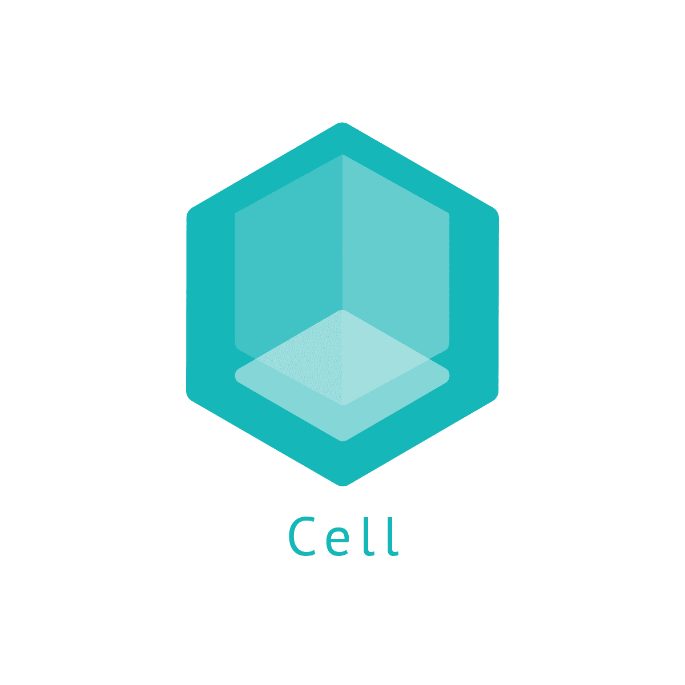

<h1 align="center">
  <a href="https://github.com/ShaharyarAhmed-bot/cell"></a><br>
  
  <a href="https://github.com/ShaharyarAhmed-bot/cell">Cellionor</a>
  
</h1>


<h4 align="center">A minimal command line text editor written in Rust</h4>

<center><p float = "middle">
<a href="https://www.rust-lang.org/"></a> </center>

</p>

***Development status:*** *The cell editor project is something I made in my free
time and is not something I activly work on. I would love to work on it more but
I dont have enough time. I will happily accept bug fixes, updates and improvements.
I have many things planned for cell and hope I can get around then. I want to make 
cell into a modern text editor which includes everything a developer would need
to write code faster and more efficently.*   
— Editor

Goals include:

* ***Incredibly high performance***. The editor should be lightning fast and complete
  all the drawing operations really quick. It shouldnt make you wait for anything              

* ***Beauty***. The editor should look stunning and fit well on all modern desktops,
  It should preform all text operations which the best tecnology avaliable
  and support Unicode fully.

* ***Reliability***. Crashing, hanging, or losing work should never happen.
* ***Plugins***. cell should support the installation, removal of plugins

* ***Custom Scripting Language***. There should be a custom scriptintg language for
the editor which will help interact with the editor on a basic level

* ***Developer friendliness***. Along the scripting language, users who do not know 
the scripting language should be able to edit and customise cell according 
to their needs without any hassle.

Screenshot:


## Getting started

Cell is avaliable for windows and linux. You can install it using <a href="https://wiki.archlinux.org/title/pacman">pacman</a> and <a href="https://snapcraft.io/">snap</a>.

It is avaliable as a snap package beacuse snap packages allow it to be packaged for a varierty of
linux distrubutions without any hassle.

MacOS and Windows is coming soon! As soon as I learn how to package it for <a href="https://brew.sh/">brew</a> and <a href ="https://docs.microsoft.com/en-us/windows/package-manager/winget/"> winget</a> 😂

## Installation
### Linux

***NOTE***: *I have created a new revision for cellionor on <a href="https://snapcraft.io">Snapcraft</a> which is currently being reviewed therfore it cannot be installed right now. However you can still install cell on Arch Linux and build the project on your own. When the reviewing process is done I will update this section.*


To install cell on linux install <a href="https://snapcraft.io/docs/installing-snapd">snap</a>
on your linux distrubution.

If you are running Arch linux go and read the Arch linux section down below..

After installing snap excecute the following:

`sudo snap install cellionor`


### Arch Linux

You can install cell on Arch Linux using the pacman package manager or any <a href="https://wiki.archlinux.org/title/AUR_helpers">AUR</a> helper:

`pacman -S cell-bin`

I have used the <a href="https://github.com/Jguer/yay">yay</a> AUR helper as an example here:

`yay -S cell-bin`


### Windows
[Windows is coming soon!]


### MacOS
[MacOS is coming soon]


### Building the project

Cell targets 'recent stable Rust'. We recommend installing via [rustup](https://www.rustup.rs).

To build the project:

```
> cargo build
```

Then you can run the project:

```
> cargo run
```

🥳Viola! The editor starts running


## License

This project is licensed under the GNU GENERAL PUBLIC LICENSE V3 [license](LICENSE).


## Contributions

I will gladly accept contributions via GitHub pull requests. I will
soon add a CONTRIBUTING.md for more details.


